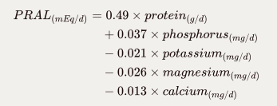

# Acidity & Nutrition Visualizer

End product will include:

* Website
* Interactive graph 
* My Intro / Research summary
  * Inspiration
  * Why alkalinity of food is important in diet
  * Why I used PRAL
* Citations of research and data
  * Data - USDA
  * Research - Whole bunch of websites about food alkalinity and why it's important

Procedure

* Download data/s 
  * Record where the data is from. Cite it
* Write Intro. Why, how, what, inspiration, hypothesis, data sources, citation, etc

* Prepare data
  * Add PRAL calculation
* Test: 
  * Lysine/Arginine as (Y)
  * PRAL as (X)

## Intro

Common health advice tells us to eat food with high protein and vitamins and low fat and cholesterol, etc. This is a sound advice, but it's missing the important factor of the food's acidity. 

Our metabolism constantly attempts to keep our blood's pH level balanced (slightly alkaline). The food we consume affects how easily our body can perform this task. A meal with high dietary acid load makes our body attempt to balance its pH by releasing alkaline rich minerals (e.g. calcium, potassium, magnesium) into the bloodstream. If the diet lacks these minerals, the body will release them from bones, teeth, and organs. This can eventually lead to chronic diseases, such as osteoporosis. Also, acidic food's nutrients cannot be properly absorbed in the digestive system and can cause nutrition deficiency. This can lead to weakened immune system. 

Today's average Western diet predominantly consists of acid-forming food high in animal protein and grains. Acidic diet is highly correlated with cardiac diseases, diabetes, and cancer. It might not be a coincidence that these are also the leading cause of death in America. 

Nutrients and acidity are important measures for a healthy diet, but most resources online don't take both into consideration. This project was inspired by the lack of resources online that take both nutrients and acidity into consideration when assessing the health benefit of food. 

Main effects of highly acidic diet:

* Nutrient Deficiency
  * Caused because Acidic food's nutrients are not properly absorbed in the digestive system
  * Weakened immune systems 
  * Hair loss
  * Osteoporosis: Body naturally balances its own pH. If the body doesn't consume enough mineral consumption (alkaline), then it uses body's own mineral reserves (i.e. calcium from bones).
* Acidosis: When your body fluid is too acidic
  * Can be caused by highly acidic diet
  * Acidic bloodstream / Acidic plaques in the bloodstream can cause many cardiovascular diseases (e.g. heart attack, stroke)
  * Excess acid in the stomach can cause heartburn, indigestion, and excess gas and bloating
  * Acidic Liver, Pancreases, and Kidneys can cause high blood pressure, high cholesterol levels, ulcers, kidney stones, and cancer. These are alkaline glands and are especially susceptible to acidic damage. 
  * Acidic skin can cause acne, eczema, dermatitis, and rashes. It also creates a Breeding ground for bacteria, yeast, fungi (Candida)

Why is knowing acidity of food important?

* People with following needs to avoid acidic food:
  * GERD / Acid Reflux
  * Stomach ulcer
  * Immune system disorder/disease

## Calculating Acidity of food

  

Potential Renal Acid Load (PRAL) is a method of calculating how much of an acid load the foods you eat put on your kidneys (**<< CITE THIS**). Acid forming food have positive PRAL score and alkaline food have negative PRAL score. Values calculated here are per 100 grams of food. 

PRAL was used instead of using the pH of food because the pH of the food has little to do with the food's acid or alkaline-forming tendencies in the body. For example, lemon is very acidic in nature but it is alkaline forming after digestion. This is because foods' effect on blood pH is not determined just by the acid in the food but also by the minerals in it. PRAL takes minerals into consideration in its calculation. This makes it a more suitable measurement for dietary purposes. 

## References

USDA Datasets

* *US Department of Agriculture, Agricultural  Research Service, Nutrient Data Laboratory. USDA National Nutrient  Database for Standard Reference, Release 28. Version Current:  September 2015, slightly revised May 2016.  Internet:  https://www.ars.usda.gov/Services/docs.htm?docid=8964*
  * https://data.nal.usda.gov/dataset/composition-foods-raw-processed-prepared-usda-national-nutrient-database-standard-reference-release-28-0
* Haytowitz, David B.; Ahuja, Jaspreet K.C.; Wu, Xianli; Somanchi, Meena;  Nickle, Melissa; Nguyen, Quyen A.; Roseland, Janet M.; Williams, Juhi  R.; Patterson, Kristine Y.; Li, Ying; Pehrsson, Pamela R.. (2019). USDA  National Nutrient Database for Standard Reference, Legacy Release.  Nutrient Data Laboratory, Beltsville Human Nutrition Research Center,  ARS, USDA. https://data.nal.usda.gov/dataset/usda-national-nutrient-database-standard-reference-legacy-release. Accessed 2020-11-15.
  * https://data.nal.usda.gov/dataset/usda-national-nutrient-database-standard-reference-legacy-release
* https://www.ars.usda.gov/northeast-area/beltsville-md-bhnrc/beltsville-human-nutrition-research-center/methods-and-application-of-food-composition-laboratory/mafcl-site-pages/sr-legacy-nutrient-search/

Research: Acidic diet and complications

* https://livelovefruit.com/acidic-foods-cause-chronic-disease/
* https://blogs.davita.com/kidney-diet-tips/dietary-acid-load-and-high-alkaline-diet-connection-to-kidney-disease/
* https://naturalhealthcourses.com/2016/02/keep-acid-reflux-at-bay-the-natural-way

Research: Acidic/Alkaline food

* https://www.phreshproducts.com
* https://greenopedia.com/alkaline-acid-food-chart/
* https://www.soultrustrecords.com/post/food-by-god-the-most-alkaline-foods

Research: Calculating Acid/Alkaline (PRAL: Potential Renal Acid Load)

* http://www.bitterpoison.com/archive/calculate-acid-alkaline-with-pral-formula/

* https://www.lifeionizers.com/blog/lemon-juice-make-you-alkaline/

* Thomas Remer, Triantafillia Dimitriou, Friedrich Manz,  Dietary  potential renal acid load and renal net acid excretion in healthy,  free-living children and adolescents, *The American Journal of Clinical Nutrition*, Volume 77, Issue 5, May 2003, Pages 1255–1260, https://doi.org/10.1093/ajcn/77.5.1255

* https://wholisticmatters.com/pral-formula-detox-blog-series-part-3/

  

